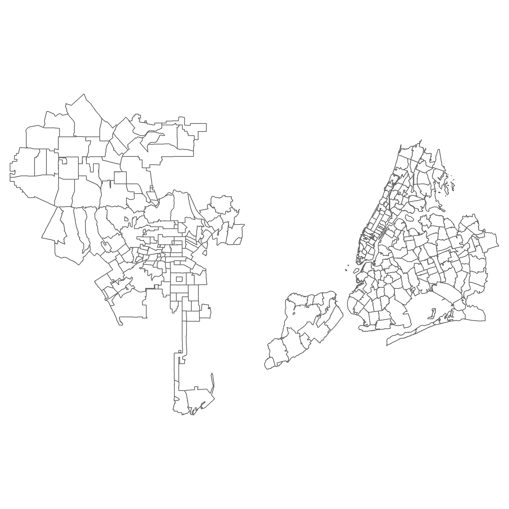
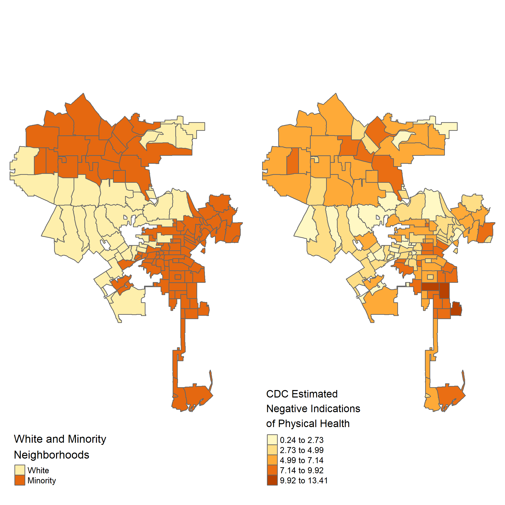
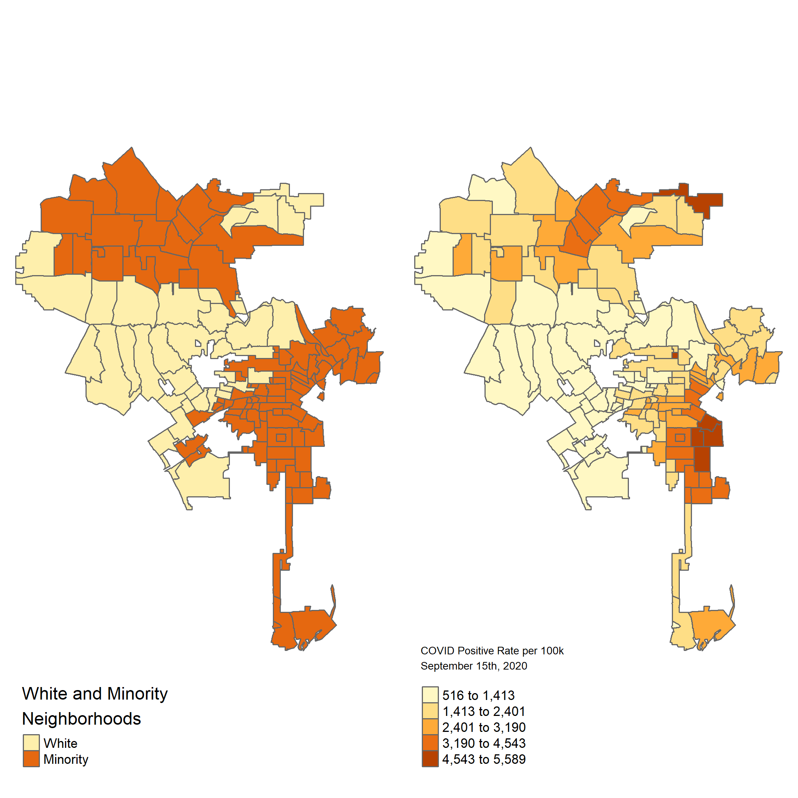

# LA-NY COVID-19 Comparison Study

## Study Overview
This is a cross-sectional study over New York City and Los Angeles city exploring the characteristics between the two geographies through a public health lens. This study is ongoing and the methods used are still being refined. The general purpose of this study is to identify characteristics that are present in both cities and to investigate the notion of vulnerability within low income communities of color whom are generally at higher risk of poorer physical health conditions and thus at a higher risk of contracting COVID19.

## Challenges
Public health departments from both cities are publishing data at different geography levels and make it challenge to make direct comparisons. Additionally, because most variables of interest (Census Demographics and CDC Health Estimates) are published at smaller geographies, an apportionment method is required to aggregate up to target geographies. This methodology has its own drawbacks that are still being evaluated if suitable for this study. 

## Initial Findings

